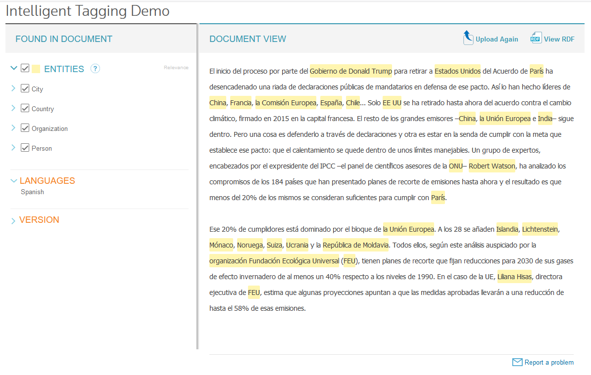
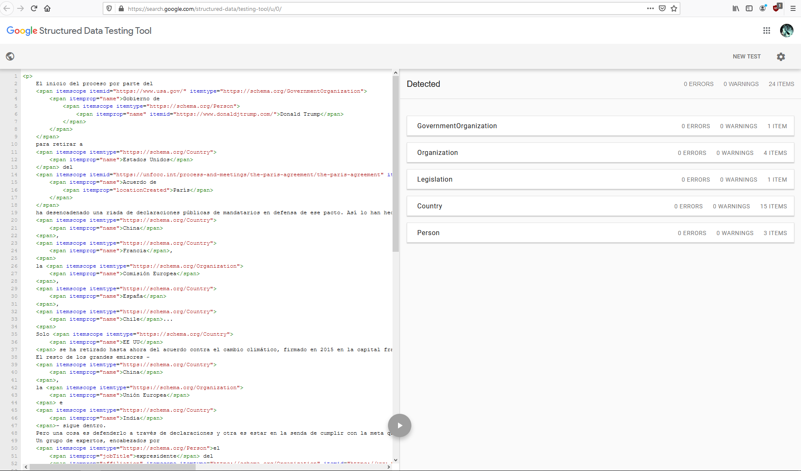
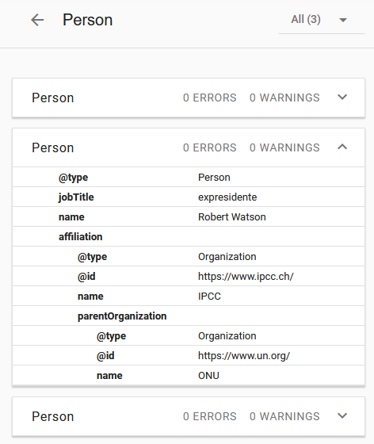

---
colorlinks: true

---

# Primer Entregable
## HTML Microdata
**Samuel Cifuentes García - UO238524**

Enlace permanente a la noticia: [Solo el 20% de los países está en la senda para cumplir con el Acuerdo de París](https://elpais.com/sociedad/2019/11/05/actualidad/1572948813_120202.html)

### Procedimiento
Primeramente, he utilizado [Open Calais](http://www.opencalais.com/) para obtener una primera lista de entidades. Esta noticia en cuestión al tratarse de un acuerdo de la ONU contiene gran cantidad de países y organizaciones implicadas, así como alguna persona. La herramienta dio muy buen resultado, marcando todos los países y personas así como la mayor parte de las organizaciones. Tuve que refinar la lista de entidades ya que alguna organización en forma de siglas no la detectó y el concepto de Acuerdo de París no lo detecta (se lanza a por la ciudad).

A continuación marqué el fichero con microdatos, _noticia-tagged.html_. Se utilizó schema.org para marcar los tipos de las entidades, intentando utilizar la entidad más precisa en cada caso. En la sección donde respondo a las cuestiones planteadas mencionaré las decisiones más importantes que tuve que tomar y el por qué de las mismas.

Una vez etiquetado, se pasó el HTML etiquetado por [Google Structured Data Testing Tool](https://search.google.com/structured-data/testing-tool/u/0/) obteniendo el siguiente resultado:

La Figura 3 es un ejemplo de una entidad relativamente compleja, una persona que trabaja en una organización que a su vez es suborganización de otra.

{.center width=50%}

### Cuestiones
#### ¿Deberían tener valor para `itemid` todos los ítems? ¿Qué valor debería asignarse? ¿Si hubiera varios candidatos cuál escogerías? ¿Por qué? ¿ Cuál crees que es la solución de compromiso que podría resultar menos polémica en la mayoría de casos?
No, no todos los ítems deberían tener itemid, pero sí es aplicable es información que debería usarse.
El criterio que seguí es utilizar una URL oficial si la hay para identificar al ítem. Esto fue sencillo en el caso de las organizaciones que aparecieron en la noticia, como el gobierno de EEUU, la UE, la ONU o suborganismos de esta última. Todas estas entidades tienen un sitio web oficial (.gov, .eu, .org) ante el cuál no hay polémica posible. En el caso del Acuerdo de París, utilicé el enlace de la ONU (concretamente, la UNFCCC) a éste, lo cuál me pareció bastante sensato.i

Las personas son más problemáticas. En caso de que lo hubiera utilizaría la página personal de la persona en sí. En el caso de Donald Trump empleé su página oficial, aunque se podría discutir que su Twitter es más representativo... En el caso de las otras dos personas no encontré una página personal para ellos, podría haber recurrido a sus entradas en la Wikipedia o en organismos por los que pasaron, pero decidí ser cauteloso y ante la duda no darles un itemid.
En el caso de los países, más de lo mismo, podría enlazar la Wikipedia, pero no está exenta de peros. ¿Qué idioma de la Wikipedia? Inglés parece una apuesta segura en una Web anglocentrista pero preferí no darles id.

#### ¿Qué inconvenientes concretos te ha supuesto la obligación de incrustar los metadatos allí donde te "forzaba" la estructura del texto?
Pues alguno, pude notar la rigidez de la estructura del texto en mis carnes. Aunque tuve suerte con alguna entidad como la que mostré en la imagen anterior, en la que la estructura del texto no dio muchos problemas para realizar esa jerarquía de entidades, en otros casos, imposibilito directamente que pudiera decir lo que me gustaría. Por ejemplo no pude decir en `gobierno de Donald Trump` que Donald Trump es el presidente de ese gobierno, simplemente por el orden en que aparecen las entidades y la falta de una propiedad específica en la entidad de Schema.org para designar al presidente/líder de una organización gubernamental. Podría haber considerado `gobierno de Donald Trump` como un affiliation de la Persona Donald Trump hacia el gobierno de EEUU, utilizando una etiqueta meta para dar el jobTitle "presidente" al item. Pero eso subyugaría la organización bajo la persona, lo cuál va contra la semántica de la noticia, donde el gobierno en sí es lo que importa, y que sea de Donald Trump es un daño colateral.
 
Es decir, la estructura del texto me limita la expresividad.

Otro fenómeno que pude observar y que muestra más limitaciones de los microdatas es el siguiente. Quería agrupar el texto completo bajo una entidad de tipo https://schema.org/NewsArticle, al ser un fragmento extraído de una noticia. Esto dio problemas a la hora de pasar por la herramienta de Google, ya que exige que un artículo de noticias tenga una serie de propiedades definidas, como el autor, la fecha de publicación, el publicador, etc. A primera vista parece salvable, sé que puedo usar:  `<meta itemprop="nombrePropiedad" content="valor">`  para completar información semántica que no esté presente en el texto puntualmente. Empecé a hacer eso hasta que me topé con el publicador. En este caso era El País. Al ser una organización, la herramienta de Google en este contexto exige que se le aporte un logo y un nombre. Llegado a este punto usar etiquetas `meta` ya no es suficiente. No puedo anidar metas dentro de otras. Habría que meter etiquetas auxiliares que admitieran cierta jerarquía como `
` y ``.  

En este momento hay que parar y mirar lo que hemos estado haciendo. ¿Tiene mucho sentido llenar un HTML con etiquetas meta y contenedores invisibles al usuario? Parece que no cuando existe una alternativa diseñada para cosas como esta, como pueda ser RDFa o JSON-LD. Por lo tanto decidí darle al César lo que es del César y limitarme a marcar semánticamente con microdata lo que está en el texto y dejar que se encarge una tecnología como JSON-LD de lo que no está en el texto.
