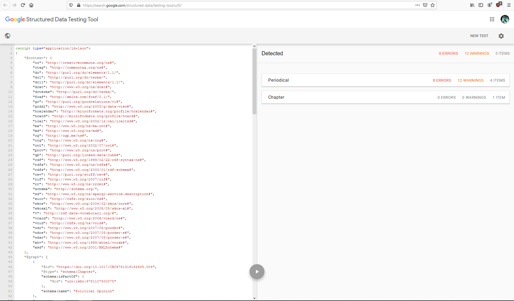
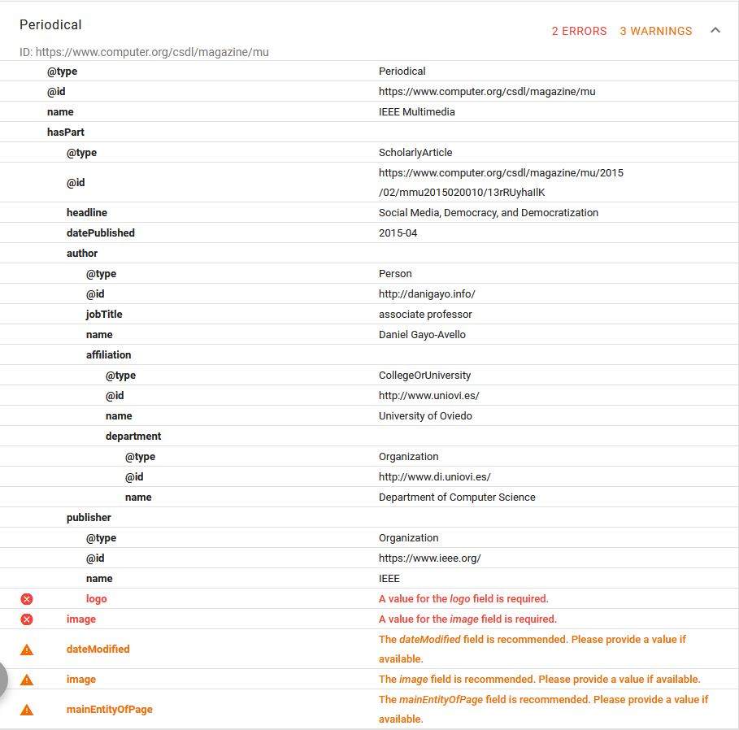

# Segundo Entregable
## JSON-LD
**Samuel Cifuentes García - UO238524**

* Como identificadores de las publicaciones periódicas utilicé la URL de la publicación en sí (no el artículo).
* El capítulo del libro tiene un DOI. El DOI del libro es _10.1017/CB09781316182635_, la del capítulo se obtiene añadiendo _.004_ al final de la del libro y lo utilicé como identificador del ítem,
* Cambridge University Press ha sido tipado como `CollegeOrUniversity`, en el [segundo ejemplo](https://schema.org/CollegeOrUniversity#WebPage-gen-215) de la entidad en schema.org, se usa como publisher, así que me atrevo a marcar Cambridge University Press como tal y no quedarme en un nivel más general de la jerarquía como pudiera ser `Organization`.
* Se usó la página http://danigayo.info/ para representar a Dani
* Las páginas http://www.uniovi.es/ y http://www.di.uniovi.es/ para representar a la Universidad de Oviedo y el Departamento de Informática respectivamente.
* Se han añadido los artículos en cuestion a las publicaciones periódicas, bajo su propiedad `hasPart`:
	- Como id usé el enlace del artículo.
	- Como tipo http://schema.org/ScholarlyArticle
	- Para el autor en los casos donde es Dani simplemente uso el id para que se referencie, en otro caso, nombres del autor/autores.
	- El título del artículo con la propiedad `headline`
	- La fecha de publicación `datePublished`
	- Y el `publisher` uso una entidad Organización donde indico nombre e id.
	
La Figura 1 muestra la salida de Google Structured Data Testing Tool. 

Los errores que marca la herramienta se deben a que Google quiere que el publisher tenga la propiedad `logo` asignada y ScholarlyArticle la propiedad `imagen`. En el caso de las imágenes directamente no la hay en caso de estos artículos en concreto, y el logo de las empresas publicadoras del artículo contenido en el `Periodical` me pareció un nivel de detalle excesivo y encontrar el logo adecuado en algunos casos no es trivial. 

Creo que están bastante bien marcados los artículos académicos sin necesidad de incluir imágenes o logos que a fin de cuentas, es lo que pide Google, no JSON-LD, como comentamos en clase de prácticas.

{.center width=70%}
